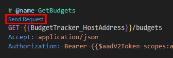

# Register application for user authentication

For testing, you can register an application that supports user authentication using [device code flow](https://learn.microsoft.com/entra/identity-platform/v2-oauth2-device-code).

1. Open a browser and navigate to the [Microsoft Entra admin center](https://entra.microsoft.com) and login using a **Work or School Account**.

1. Select **Applications** in the left-hand navigation bar, then select **App registrations**.

1. Select **New registration**. Enter a name for your application, for example, `Budget Tracker Testing`.

1. Set **Supported account types** to **Accounts in this organizational directory only**.

1. Leave **Redirect URI** empty.

1. Select **Register**. On the application's **Overview** page, copy the value of the **Application (client) ID** and **Directory (tenant) ID**.

1. Select **Authentication** under **Manage**. Locate the **Advanced settings** section and change the **Allow public client flows** toggle to **Yes**, then choose **Save**.

## Add registration details to test file

1. Open [BudgetTracker.http](./api/BudgetTracker.http) in Visual Studio Code.

1. Replace all instances of `API_CLIENT_ID` with the **Application (client) ID** you generated in the previous steps.

1. Replace all instances of `TENANT_ID` with the **Application (client) ID** you generated in the previous steps.

1. If you do not have the [REST Client](https://marketplace.visualstudio.com/items?itemName=humao.rest-client) Visual Studio Code extension installed, install it before proceeding to the next step.

1. Locate the **GetBudgets** request in **BudgetTracker.http**. Select the **Send Request** link to send this request in order to initialize authentication.

    

1. In the dialog, select **Sign in** to open your browser to the sign in page.

1. At the **Enter code** prompt, paste the code and select **Next**. Follow the prompts until you see a success message.

1. Return to Visual Studio Code and select **Done** in the dialog.

1. The API response is displayed in a new tab.

After you've initialized authentication with the **GetBudgets** request, you can test the other requests in the file.
